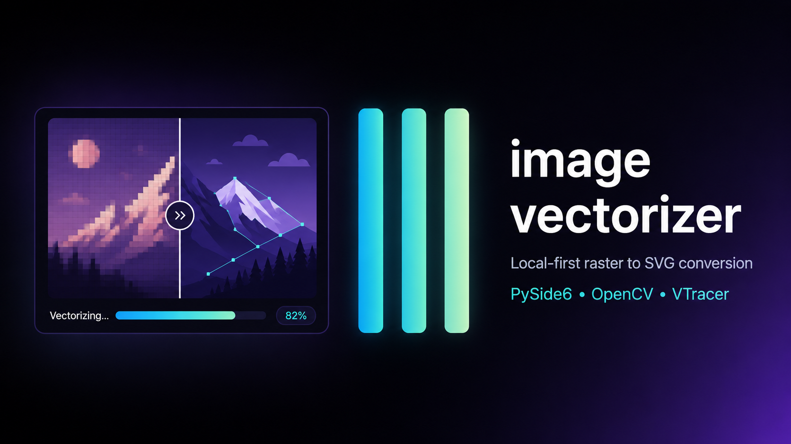

# Image Vectorizer

<p align="center">
  
</p>

Last updated: 2026-06-05

Image Vectorizer is a Python and PySide6 desktop application foundation for
working with raster images. The current application supports local image import,
original and processed previews, image metadata display, and an initial
grayscale and threshold processing pipeline. It can also detect, simplify, and
preview color-aware vector paths using configurable quality, background removal,
and comparison controls. The desktop UI supports accessible Light, Dark, and
System theme modes, single SVG export, and responsive batch SVG processing.

## Install Dependencies

```bash
python -m pip install -r requirements.txt
```

## Run

From the project root:

```bash
python main.py
```

Or use the development runner:

```bash
python scripts/run_dev.py
```

## Build & Packaging

To bundle the application into a standalone desktop executable for distribution:

### On Windows
```cmd
.venv\Scripts\python scripts\build_app.py
```

### On macOS / Linux
```bash
.venv/bin/python scripts/build_app.py
```

The script will automatically handle:
1. Cleaning previous build output folders.
2. Generating a clean build using the configuration from `image_vectorizer.spec`.
3. Creating the standalone package in the `dist/` directory.
4. Auto-detecting the application icon in `app/resources` using the native
   platform icon format when available.
5. Running a post-build cleanup on temporary compilation artifacts.
6. Using PyInstaller from `.venv` or the system PATH.

## Documentation

Project documentation is available in `docs/`.

- `docs/architecture/` for system and pipeline architecture.
- `docs/developer/` for setup, verification, benchmark, and packaging guides.
- `docs/product/` for project overview, glossary, status, and roadmap.
- `docs/user/` for UI workflow, performance tips, and troubleshooting.

## CI/CD & Release Automation

We use GitHub Actions to automate desktop application builds, version tagging, and release publishing.

### 1. CI Build Workflow (`build.yml`)
- Triggered automatically on push or pull requests to the `main` branch, or via manual run (`workflow_dispatch`).
- Builds standalone application packages for Windows, macOS, and Linux in parallel.
- Uploads the build outputs as workflow artifacts (`Image-Vectorizer-Windows`, `Image-Vectorizer-macOS`, `Image-Vectorizer-Linux`).

### 2. Manual Tag Workflow (`create_tag.yml`)
- Triggered manually from the Actions tab.
- Accepts a semantic version tag (e.g. `v1.0.0`) and pushes it to the repository after validating that the format matches `v*.*.*` and the tag does not already exist.

### 3. Release Publication Workflow (`release.yml`)
- Automatically triggered when a new version tag (`v*.*.*`) is pushed.
- Re-builds the application packages for all target platforms, compiles them, and attaches the archived builds to a newly created GitHub Release using the version number as the release name.

### Difference Between Manual and CI Build
- **Manual Build**: Runs locally via `scripts/build_app.py`. Uses local system libraries, virtual environment compilers, and target architecture. Best for fast local verification.
- **CI Build**: Runs inside clean, isolated containers on GitHub-hosted runners (Windows, macOS, Linux). Guarantees reproducible builds and doesn't pollute local environments.

