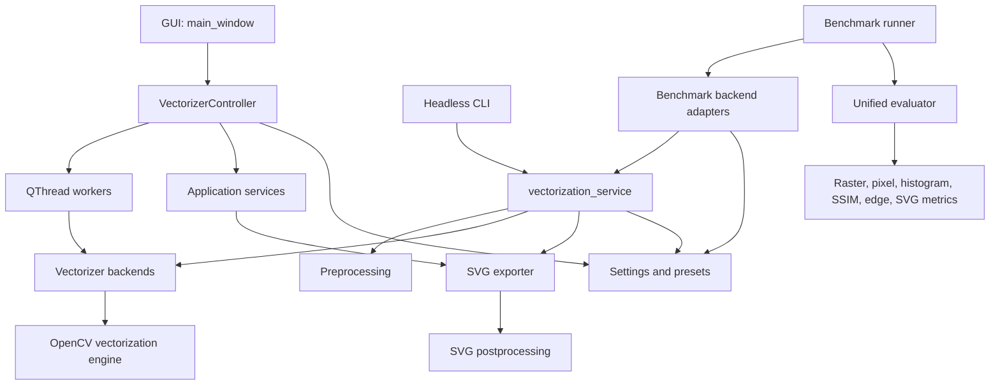
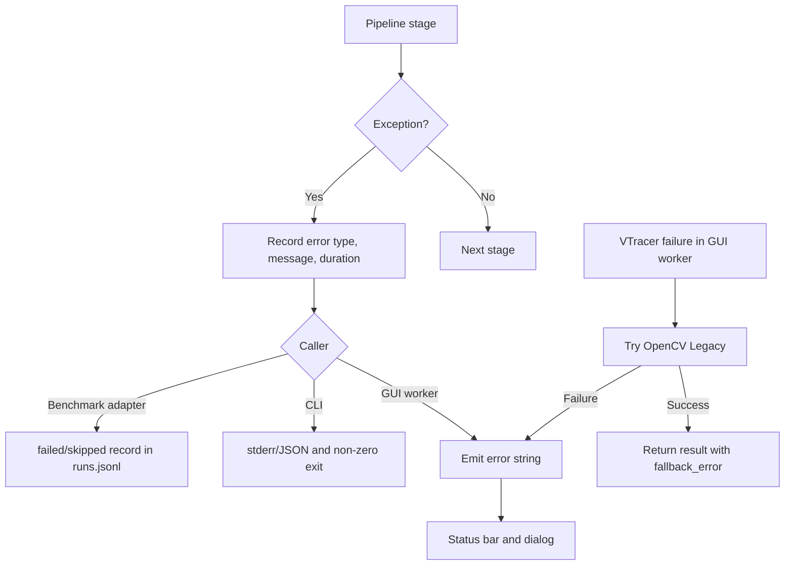

# Silukman Image Vectorizer Architecture

Dokumen ini menjelaskan arsitektur implementasi saat ini. Istilah **pipeline
kanonik** di bawah merujuk pada
`app.core.vectorization_service.vectorize_image()`, yang dipakai oleh CLI
headless dan backend Silukman pada sistem benchmark. GUI memakai orkestrasi
threaded tersendiri, tetapi berbagi model konfigurasi, backend vectorization,
engine OpenCV, dan SVG exporter yang sama.

## Context

Silukman Image Vectorizer adalah aplikasi Python lokal untuk mengubah raster
PNG, JPEG, BMP, atau WebP menjadi SVG. Produk menyediakan tiga permukaan utama:

- GUI desktop PySide6 untuk preview dan tuning interaktif;
- CLI headless untuk single image, batch, inspeksi SVG, dan benchmark;
- sistem riset untuk membandingkan Silukman dengan VTracer langsung, Potrace,
  dan Inkscape serta menghitung kualitas, kompleksitas, dan performa.

VTracer adalah backend utama untuk tracing warna. Backend OpenCV Legacy
menyediakan contour-based vectorization dan fallback pada jalur GUI.

## Goals

- Menjaga vectorization dapat dipakai dari GUI, CLI, dan benchmark.
- Memisahkan UI, orkestrasi, algoritme, backend, dan I/O SVG.
- Menyediakan hasil yang dapat diaudit melalui konfigurasi, hash, timing,
  preprocessing log, warning, dan metric output.
- Mempertahankan GUI responsif dengan pekerjaan CPU/I/O di `QThread`.
- Mendukung backend alternatif dan eksperimen yang reproducible.
- Menulis SVG secara aman melalui validasi path dan atomic replacement.

## Non-goals

- Layanan web, API server, akun pengguna, atau penyimpanan cloud.
- Distributed processing atau scheduler benchmark lintas mesin.
- Editor SVG umum atau manipulasi path secara manual.
- Jaminan bit-for-bit identical SVG di semua backend dan platform.
- Sandbox untuk executable baseline eksternal.
- Implementasi tracing spline mandiri; spline utama didelegasikan ke VTracer.

## Modules

| Area | Modul utama | Tanggung jawab |
|---|---|---|
| Entry points | `main.py`, `app/cli.py`, `app/cli_headless.py` | Menjalankan GUI atau command headless. |
| GUI | `app/main_window.py`, `app/ui/` | Layout, event binding, preview, theme, dialog, dan feedback pengguna. |
| Controller | `app/controllers/vectorizer_controller.py` | Menjembatani event GUI, state, service, dan worker. |
| Workers | `app/workers/threads.py` | Threshold preview, vectorization, dan batch di background thread. |
| Configuration | `app/config/settings.py`, `app/config/preset_manager.py` | Model konfigurasi tervalidasi dan preset JSON. |
| Core pipeline | `app/core/vectorization_service.py` | Orkestrasi kanonik load–preprocess–vectorize–export–metrics. |
| Preprocessing | `app/core/preprocessing.py` | Background removal, palette replacement, quantization, threshold. |
| Vectorization | `app/core/vectorizer_backend.py`, `app/core/vectorization_engine.py` | Adapter VTracer/OpenCV dan contour engine. |
| Postprocessing | `app/core/postprocessing.py` | Parse/validasi, normalisasi, optimasi, serialisasi, dan metric SVG dasar. |
| Result and diagnostics | `app/core/result.py`, `app/core/exceptions.py`, `app/core/logging.py` | Result record, hash, exception taxonomy, dan structured logging. |
| Application services | `app/services/` | Load/validasi image, export, batch, file dialog, settings, dan palette. |
| Benchmark | `benchmark/runner/`, `benchmark/baselines/`, `benchmark/evaluation/`, `benchmark/analysis/` | Menjalankan eksperimen, baseline, evaluasi, agregasi, dan report. |

## Dependency Direction

Dependency yang dituju adalah dari adapter luar menuju domain/pipeline dalam:

Aturan praktisnya:

- UI tidak mengimplementasikan algoritme tracing atau penulisan SVG.
- Controller mengorkestrasi service dan worker, bukan sebaliknya.
- Backend bergantung pada model konfigurasi dan engine, tetapi tidak bergantung
  pada GUI atau CLI.
- Benchmark mengadaptasi aplikasi melalui `SilukmanBackend`; core application
  tidak bergantung pada benchmark.
- `app/services/svg_exporter.py` mengonsumsi `VectorResult` dan postprocessing;
  engine tidak menulis file.

Pengecualian yang masih ada dicatat di
[Technical debt](#technical-debt), terutama dua orkestrator vectorization yang
belum disatukan.

## GUI

`app/cli.py` membuat `QApplication`, memvalidasi resource runtime, lalu membuka
`MainWindow`. `MainWindow` membangun service dan menyuntikkannya ke
`VectorizerController`.

Alur interaktifnya:

1. `ImageLoaderService` mendelegasikan validasi dan decode ke
   `app.services.image_loader`.
2. `ImageProcessorThread` menghasilkan threshold preview dan array grayscale.
3. `VectorizationThread` memilih VTracer atau OpenCV Legacy.
4. Jika VTracer melempar exception, worker mencoba OpenCV Legacy dan menyimpan
   pesan awal pada `VectorResult.fallback_error`.
5. `MainWindow` merender raw SVG VTracer dengan `QSvgRenderer`, atau menggambar
   `VectorPath` OpenCV dengan `QPainter`.
6. `ExportService` mendelegasikan penulisan ke shared SVG exporter.

Controller menahan state pada `VectorizationState`, mengambil snapshot settings
sebelum thread dimulai, membuang stale result, dan hanya mengantre request
terbaru ketika worker masih aktif.

## Core

Core terdiri dari kontrak dan transformasi yang tidak bergantung pada widget:

- `VectorizationConfig`/`VectorizationSettings` adalah dataclass tervalidasi
  untuk opsi global, OpenCV, dan VTracer.
- `VectorResult`/`VectorPath` adalah representasi in-memory dari output OpenCV.
- `VTracerVectorResult` memperluas `VectorResult` dengan raw `svg_data`.
- `VectorizationResult` adalah execution record untuk CLI/benchmark, bukan
  geometri vector; record ini menyimpan status, hash, ukuran file, waktu,
  konfigurasi, log preprocessing, warning, dan metric dasar.
- `vectorize_image()` adalah façade sinkron untuk pipeline kanonik.

## Preprocessing

`app/core/preprocessing.py` membaca image dengan
`cv2.IMREAD_UNCHANGED` agar alpha channel dipertahankan. `preprocess_image()`
menjalankan operasi berikut secara berurutan jika diaktifkan:

1. background removal berdasarkan rata-rata empat corner dan Euclidean color
   distance;
2. exact RGB palette replacements;
3. deterministic K-Means quantization (`cv2.setRNGSeed(42)`), dengan sampling
   maksimum 100.000 training pixels dan median filtering label.

Grayscale threshold tidak dijalankan secara global. Pipeline kanonik hanya
menambahkannya untuk OpenCV Legacy. GUI selalu membuat threshold preview karena
array tersebut juga menjadi input fallback OpenCV.

## Vectorization Backend

`VectorizerBackend` mendefinisikan `vectorize()`, capability flags, dan nama
engine.

### VTracer

`VTracerVectorizerBackend`:

- memastikan dependency dan source image tersedia;
- memetakan serta meng-clamp setting VTracer;
- memanggil `vtracer.convert_image_to_svg_py()` ke temporary SVG;
- membaca raw SVG, memvalidasi root XML/SVG, dan menghitung metric heuristik;
- mengembalikan `VTracerVectorResult`.

### OpenCV Legacy

`OpenCVVectorizerBackend` menerima threshold array atau membuat threshold dari
file. Backend membaca color image dan memanggil
`app.core.vectorization_engine.vectorize()`.

Engine:

- menormalisasi mask dan memvalidasi settings;
- menangani alpha/background mask, quantization, invert, dan smoothing;
- membuat mask per warna;
- menemukan outer contour dan holes dengan `cv2.RETR_CCOMP`;
- memfilter berdasarkan `min_area`;
- menyederhanakan contour menggunakan `cv2.approxPolyDP`;
- mengurutkan path dari area terbesar agar layer kecil tetap terlihat.

## Postprocessing

`app/core/postprocessing.py` menyediakan:

- parse XML dan validasi root `<svg>`;
- penambahan `viewBox` bila width/height tersedia;
- penghapusan empty `<g>`;
- exact fill/stroke palette replacement;
- deterministic ElementTree serialization;
- metric dasar berupa path count, total element, dan perkiraan command/point.

`app/services/svg_exporter.py` membangun SVG untuk OpenCV atau memakai raw SVG
VTracer, menyisipkan metadata aplikasi/source/timestamp, lalu menulis melalui
temporary file dan `os.replace()`.

## CLI

Console script `silukman-vectorizer` mengarah ke
`app.cli_headless.main()`. Subcommand yang tersedia:

- `gui`;
- `presets`;
- `vectorize` dan `vectorize --dry-run`;
- `batch`, dengan `ThreadPoolExecutor`, resume/overwrite policy, manifest,
  `runs.jsonl`, per-file log, dan summary;
- `inspect`, untuk validasi dan metric struktur SVG;
- `benchmark`, sebagai façade untuk runner dan modul analysis/report.

Single-image dan batch CLI memakai pipeline kanonik `vectorize_image()`.

## Benchmark System

`ExperimentRunner` membaca YAML melalui `BenchmarkConfig`, memfilter CSV
manifest berdasarkan split/category, menangkap environment dan Git metadata,
kemudian membuat Cartesian product:

`image × backend × preset × repetition`.

Registry benchmark berisi:

- `SilukmanBackend`, yang memanggil pipeline aplikasi;
- `VTracerBackend`, `PotraceBackend`, dan `InkscapeBackend`, yang membungkus
  baseline runner;
- `run_isolated_process()`, yang memberi timeout dan terminasi process group
  untuk executable eksternal.

Setiap vectorization yang berhasil dievaluasi oleh `UnifiedQualityEvaluator`.
SVG dirasterisasi kembali dengan `PySide6.QtSvg` pada ukuran raster asli,
kemudian dihitung:

- MAE, RMSE, dan PSNR;
- histogram correlation;
- SSIM;
- edge F1;
- SVG bytes, path count, dan command count;
- wall-clock time dan peak memory bila backend menyediakannya.

Record ditulis append-safe ke `runs.jsonl`; manifest, output SVG, log, summary,
dan temporary evaluation raster ditempatkan di direktori experiment. Resume
memakai experiment/config hash dan dapat mengulang failed runs.

## Data Flow

```mermaid
flowchart LR
    Input["Raster input"] --> Decode["Decode and metadata"]
    Decode --> Normalize["Optional preprocessing"]
    Normalize --> Choice{"engine_type"}
    Choice -->|VTracer| VT["VTracer native SVG"]
    Choice -->|OpenCV Legacy| Threshold["Grayscale threshold"]
    Threshold --> Contours["Color masks, contours, holes, simplify"]
    Contours --> VR["VectorResult"]
    VT --> Export["Validate, normalize, metadata, atomic write"]
    VR --> Export
    Export --> SVG["SVG file"]
    SVG --> BasicMetrics["Basic SVG metrics and hashes"]
    SVG -->|benchmark only| Rasterize["Rasterize at source dimensions"]
    Rasterize --> Quality["Quality and complexity metrics"]
    BasicMetrics --> Record["VectorizationResult / runs.jsonl"]
    Quality --> Record
```

## Error Flow

Pipeline kanonik menginisialisasi `VectorizationResult.status` sebagai
`failed`, mengisi `error_type`, `error_message`, dan timing sebelum melempar
exception. Kategori domain tersedia di `app/core/exceptions.py`, termasuk
input, preprocessing, vectorization, SVG, metric, dataset, backend, dan
experiment.

Metric benchmark bersifat best-effort: nilai yang gagal tetap `null` dan pesan
ditambahkan ke `errors`, sehingga kegagalan tidak disamarkan sebagai nilai nol.

## Extension Points

- Tambahkan application backend dengan subclass
  `app.core.vectorizer_backend.VectorizerBackend`.
- Tambahkan baseline riset dengan implementasi
  `benchmark.baselines.backend_interface.VectorizerBackend` dan daftarkan di
  `ExperimentRunner._initialize_backends()`.
- Tambahkan preprocessing operation sebagai fungsi pure-ish `(image, config) ->
  (image, metadata)` lalu panggil dari `preprocess_image()`.
- Tambahkan preset pada `app/config/presets.json` melalui `PresetManager`.
- Tambahkan metric evaluator mandiri dan koordinasikan di
  `UnifiedQualityEvaluator`.
- Tambahkan command analysis/report melalui parser dan dispatcher
  `cmd_benchmark()`.
- Tambahkan postprocessing transform berbasis `ElementTree` sebelum
  `serialize_deterministic_svg()`.

## Technical Debt

1. **Dua jalur orkestrasi.** GUI/batch desktop memanggil backend langsung,
   sedangkan CLI/benchmark memakai `vectorize_image()`. Preprocessing log,
   metric extraction, dan exception mapping karenanya tidak identik.
2. **Fallback tidak konsisten.** GUI worker memiliki VTracer → OpenCV fallback;
   pipeline kanonik memilih satu backend dan tidak melakukan fallback meskipun
   masih memeriksa `fallback_error`.
3. **Exception translation terlalu lebar.** Blok preprocess/vectorize pada
   `vectorization_service.py` menangkap semua exception dan membungkusnya
   sebagai `PreprocessingError`, sehingga kategori asal dapat kabur.
4. **Validasi SVG parsial.** Validasi hanya memastikan XML valid dan root
   `<svg>`; exporter memiliki best-effort fallback yang tetap dapat menulis raw
   SVG ketika postprocessing gagal.
5. **Metric SVG heuristik.** Command count dihitung dari pasangan angka pada
   atribut `d`; `original_point_count` VTracer diperkirakan sebagai tiga kali
   simplified count.
6. **Versi benchmark hard-coded.** `SilukmanBackend.version()` belum membaca
   package version dan masih mengembalikan nilai statis.
7. **Konfigurasi compatibility shim.** `VectorizationSettings` masih alias dari
   `VectorizationConfig`, dan property `vtracer` mengembalikan object yang sama
   untuk kompatibilitas format lama.
8. **Memory metric belum lengkap.** Backend Silukman melaporkan
   `peak_memory_bytes = 0`, bukan pengukuran aktual.
9. **Temporary-file lifecycle tersebar.** Core service, VTracer backend, dan
   evaluator masing-masing mengelola temporary file sendiri.
10. **Dokumen lama.** `docs/architecture.md` dan beberapa phase README masih
    menyebut modul historis seperti `image_pipeline.py`; dokumen ini adalah
    sumber arsitektur terkini.
