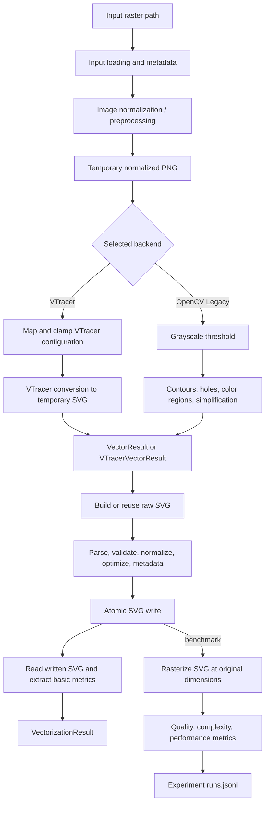
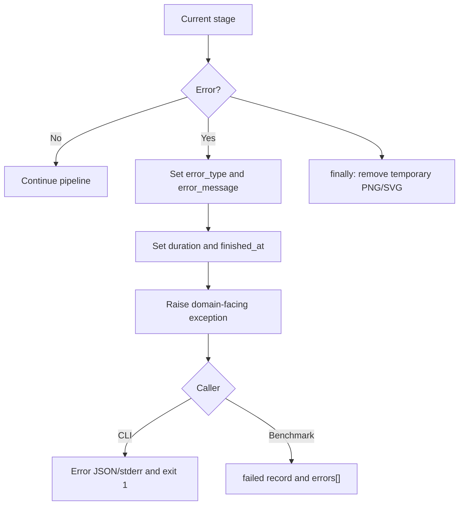

# Vectorization Pipeline

Dokumen ini menjelaskan pipeline yang benar-benar dijalankan oleh
`app.core.vectorization_service.vectorize_image()`. Jalur ini digunakan oleh
subcommand CLI `vectorize`/`batch` dan oleh `SilukmanBackend` pada benchmark.

GUI memakai controller dan `QThread` agar responsif. GUI berbagi backend,
OpenCV engine, dan SVG exporter, tetapi saat ini tidak memanggil façade
`vectorize_image()` secara langsung. Perbedaan tersebut dijelaskan pada
[Runtime Variants](#runtime-variants).

## Pipeline Overview



## 1. Input Loading

Implementasi: `app/core/vectorization_service.py`.

1. Dibuat `run_id`, UTC start timestamp, dan monotonic performance timer.
2. `VectorizationResult` diinisialisasi dengan status `failed` agar incomplete
   execution tidak terlihat sukses.
3. Source path diperiksa dengan `os.path.exists()`.
4. Output path dinormalisasi oleh `normalize_svg_path()`; suffix `.svg`
   ditambahkan bila perlu, dan parent harus ada, berupa directory, serta
   writable.
5. SHA-256, file size, dan extension input dicatat.
6. `cv2.imread(..., cv2.IMREAD_UNCHANGED)` dipakai untuk memastikan raster dapat
   didecode dan untuk mengambil width/height tanpa membuang alpha channel.

Kegagalan file missing atau decode menghasilkan `InputImageError`. Output path
invalid dibungkus menjadi `VectorizationError`.

## 2. Image Normalization

Implementasi: `app/core/preprocessing.py::preprocess_image()`.

Image dibaca ulang dengan `cv2.IMREAD_UNCHANGED`. Tidak ada resize atau
colorspace conversion global; dimensi dan channel asli dipertahankan selama
mungkin. Normalisasi di sini berarti menghasilkan array OpenCV yang konsisten
setelah optional transforms.

Setelah preprocessing, array selalu ditulis ke temporary `.png` melalui
`cv2.imwrite()`. PNG dipakai sebagai input backend sehingga:

- hasil preprocessing dan alpha dapat diteruskan tanpa JPEG loss;
- backend menerima path file yang stabil;
- input temporary dibersihkan pada blok `finally`.

## 3. Optional Preprocessing

Urutan implementasi tidak dapat dipertukarkan:

### 3.1 Background removal

Aktif bila `remove_background` bernilai true.

- Grayscale dikonversi ke BGR; BGR dikonversi ke BGRA.
- Background color diperkirakan dari rata-rata empat corner.
- Euclidean distance setiap pixel terhadap warna tersebut dibandingkan dengan
  `bg_tolerance`.
- Pixel di bawah tolerance diberi alpha `0`.
- Jumlah pixel dan estimated background color dicatat pada preprocessing log.

### 3.2 Palette replacement

Aktif bila `palette_replacements` tidak kosong.

- Tuple setting menggunakan RGB, sedangkan array OpenCV menggunakan BGR.
- Replacement hanya berlaku untuk exact color match.
- Pixel pengganti pada image ber-alpha dibuat opaque.

### 3.3 Color quantization

Aktif hanya untuk `color_mode == "Custom colors"`.

- Pixel transparan dikeluarkan dari training.
- Training dibatasi pada sample deterministik maksimum 100.000 pixel.
- Jumlah cluster tidak pernah melebihi jumlah warna unik.
- OpenCV K-Means memakai RNG seed `42`, K-Means++, tiga attempt, maksimum 30
  iteration, dan epsilon `0.5`.
- Semua foreground pixel ditetapkan ke center terdekat dalam chunk 50.000.
- Median filter label memakai kernel `3` bila `preserve_edges`, selain itu `5`.

Setiap operation mengembalikan metadata yang disimpan pada
`VectorizationResult.preprocessing_log`.

### 3.4 Threshold khusus OpenCV

`apply_grayscale_threshold()` tidak dipanggil untuk VTracer. Untuk OpenCV
Legacy, image hasil preprocessing dikonversi dari Gray/BGR/BGRA ke grayscale
dan di-threshold secara binary menggunakan `threshold_val`.

## 4. VTracer Configuration

Implementasi: `app/core/vectorizer_backend.py::VTracerVectorizerBackend`.

`VectorizationConfig.vtracer` saat ini adalah compatibility property yang
mengembalikan config object yang sama. Field berikut dipetakan ke
`vtracer.convert_image_to_svg_py()`:

| Setting | Default | Clamp aktual |
|---|---:|---:|
| `colormode` | `color` | choice divalidasi config |
| `hierarchical` | `stacked` | choice divalidasi config |
| `mode` | `spline` | choice divalidasi config |
| `filter_speckle` | 4 | 0–1024 |
| `color_precision` | 6 | 1–8 |
| `layer_difference` | 16 | 0–255 |
| `corner_threshold` | 60 | 0–180 |
| `length_threshold` | 4.0 fallback backend | 3.5–10.0 |
| `max_iterations` | 10 fallback backend | 1–100 |
| `splice_threshold` | 45 | 0–180 |
| `path_precision` | 8 | 0–16 |

Dataclass config sendiri memiliki default `length_threshold = 3.5` dan
`max_iterations = 16`; fallback backend di tabel hanya dipakai bila atribut
tersebut tidak tersedia.

## 5. Vectorization

### 5.1 VTracer path

1. Dependency `vtracer` dan source file diverifikasi.
2. Dibuat temporary `.svg`.
3. `convert_image_to_svg_py()` menerima temporary PNG dan mapped settings.
4. SVG dibaca kembali dan harus non-empty.
5. Dimensi dibaca dengan Pillow, dengan fallback OpenCV.
6. SVG diparse untuk mengambil path count dan estimated point counts.
7. Raw SVG disimpan dalam `VTracerVectorResult.svg_data`.
8. Temporary SVG dihapus pada `finally`.

Pipeline kanonik tidak melakukan automatic fallback bila VTracer gagal.

### 5.2 OpenCV Legacy path

`OpenCVVectorizerBackend` meneruskan threshold array dan color image hasil
preprocessing ke `app.core.vectorization_engine.vectorize()`.

Engine melakukan:

1. validasi array 2D, numeric/finite pixel, dan range setting;
2. binary mask normalization;
3. optional bilateral filter untuk `preserve_edges`;
4. alpha/background mask dan quantization region tambahan;
5. optional invert;
6. optional Gaussian smoothing dan binary threshold ulang;
7. mask terpisah per quantized color;
8. `cv2.findContours(..., RETR_CCOMP, CHAIN_APPROX_SIMPLE)`;
9. outer contour/holes association;
10. area filtering dan Douglas–Peucker simplification;
11. RGB fill selection;
12. pengurutan path berdasarkan area menurun.

Hasilnya adalah `VectorResult` berisi path, holes, dimensions, dan jumlah point.

## 6. SVG Validation

Validasi terjadi dua kali pada jalur VTracer:

- backend memanggil `parse_and_validate_svg()` sebelum membuat result;
- exporter memparse lagi sebelum postprocessing dan write.

Untuk OpenCV, `build_svg_document()` lebih dahulu membangun root `<svg>`,
dimensions/viewBox, metadata, dan compound path dengan `fill-rule="evenodd"`.
Exporter lalu memvalidasi document yang dibangun.

Validasi saat ini memastikan:

- string tidak kosong;
- XML dapat diparse oleh `xml.etree.ElementTree`;
- root element adalah `<svg>`, dengan atau tanpa namespace.

Validasi ini bukan full SVG schema validation atau sanitization policy.

## 7. Postprocessing

Implementasi: `app/core/postprocessing.py` dan
`app/services/svg_exporter.py`.

Setelah parse berhasil:

1. `viewBox` ditambahkan bila belum ada dan width/height tersedia;
2. empty `<g>` tanpa attribute dan text dihapus secara iteratif;
3. metadata aplikasi, export timestamp, dan source filename disisipkan pada
   posisi pertama;
4. ElementTree diserialisasi dengan XML declaration.

Untuk OpenCV output, path memakai closed `M/L/Z` commands, RGB fill/stroke,
`fill-rule="evenodd"`, stroke width `0.75`, dan round line join.

Exporter mempunyai best-effort fallback: bila parse/postprocessing melempar
exception, raw VTracer SVG diberi metadata melalui text insertion jika
memungkinkan; OpenCV memakai document awal.

## 8. Metric Extraction

### 8.1 Metric pipeline kanonik

Setelah SVG berhasil ditulis, file dibaca kembali dan diparse. Metric berikut
disimpan pada `VectorizationResult`:

- `path_count`;
- `element_count`;
- `estimated_command_count`.

Command count adalah heuristik: semua angka pada atribut path `d` dihitung,
lalu dibagi dua. Kegagalan metric tidak menggagalkan vectorization; warning
ditambahkan ke result.

Result juga menyimpan:

- input/output SHA-256 dan byte size;
- input format/dimensions;
- configuration snapshot;
- preprocessing log;
- warning;
- UTC finish timestamp dan monotonic duration.

### 8.2 Metric pipeline benchmark

`UnifiedQualityEvaluator` menambah:

- SVG bytes, path count, dan path command count;
- MAE, RMSE, PSNR;
- histogram correlation;
- SSIM;
- edge F1;
- wall-clock duration dan peak memory bila disediakan backend.

SVG dirasterisasi dengan `PySide6.QtSvg` ke PNG berukuran sama dengan raster
input. Metric failure menghasilkan `null` dan entry pada `errors`, bukan nilai
default nol.

## 9. Output Storage

### 9.1 SVG application output

`normalize_svg_path()` memvalidasi destination. `_atomic_write_text()` menulis
ke temporary file dalam directory tujuan, melakukan `flush()` dan `fsync()`,
kemudian mengganti target dengan `os.replace()`. Temporary file dibersihkan
pada `finally`.

### 9.2 CLI batch output

`silukman-vectorizer batch` membuat:

```text
<output-dir>/
├── config.json
├── manifest.json
├── runs.jsonl
├── summary.json
├── logs/
│   └── <image>.log
└── outputs/
    └── <image>_vectorized.svg
```

File diproses melalui `ThreadPoolExecutor`; `runs.jsonl` di-flush setelah setiap
record. Resume membaca `input_path` yang telah diproses, sedangkan overwrite
dan existing-file behavior dikontrol oleh flag CLI.

### 9.3 Benchmark output

`ExperimentRunner` membuat:

```text
experiments/<experiment-id>/
├── manifest.json
├── runs.jsonl
├── summary.json
├── logs/
├── outputs/
│   └── <run-id>.svg
└── tmp/
```

Experiment ID mengandung UTC timestamp, experiment name, short Git SHA, dan
config hash. Record JSONL di-flush per run. Resume membersihkan truncated JSONL
line, memverifikasi config hash, dan dapat mengulang failed run.

## Error and Cleanup Semantics



Catatan implementasi: exception pada gabungan blok preprocessing dan backend
vectorization saat ini dibungkus sebagai `PreprocessingError`, walaupun
penyebab awalnya dapat berasal dari backend.

## Runtime Variants

| Surface | Orkestrator | Preprocessing | Fallback | Result/metrics |
|---|---|---|---|---|
| CLI single/batch | `vectorize_image()` | Seluruh optional stages | Tidak otomatis | `VectorizationResult` + basic SVG metrics |
| Benchmark Silukman | `SilukmanBackend` → `vectorize_image()` | Sama dengan CLI | Tidak otomatis | Basic metrics + unified evaluator |
| GUI single | `VectorizerController` + workers | Threshold preview; backend dipanggil langsung | VTracer → OpenCV | In-memory `VectorResult`; preview/status |
| GUI batch | `BatchProcessingThread` → `process_batch()` | Backend dipanggil langsung | VTracer → OpenCV per file | Success/failure counts dan exported SVG |

Karena varian GUI belum melalui façade kanonik, perubahan tahap pipeline harus
diuji pada kedua jalur sampai orkestrasi tersebut disatukan.
